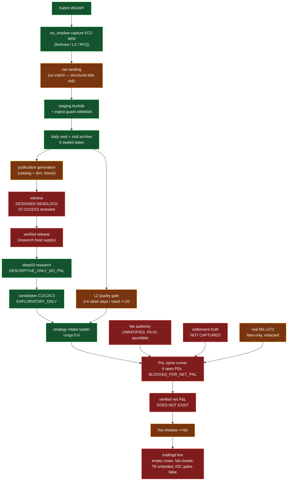

# QUANT SYSTEM AUDIT & PROFIT ROADMAP

**Date:** 2026-07-23 · **HEAD:** `5610a34` (branch `w-pnl-spine-v1`) · **Mode:** read-only adversarial audit
**Legend:** FACT = cited file:line/commit · INFERENCE = reasoned from facts · UNKNOWN = no evidence found
**Freshness caveat:** repo is under concurrent modification — `5610a34` ("Implement fail-closed IOC exit executor") landed during this audit. All cites re-verified at HEAD.
**Scope caveat:** the production publication/witness Python (`publication_generation.py`, `canonical_generation_witness.py`, `prune_gate.py`, …) lives on EC2 (`/opt/kalshi-research-v3`, `/home/ubuntu/hft-bot`), NOT in this repo. Claims about it are INFERENCE via build/audit mailbox specs quoting prod file:line. Commits `1ca85be`/`77896ca0` (W-PERM-01) are not in local git.

---

## 1. STATUS TABLE

| Domain | Status | Basis (evidence) |
|---|---|---|
| **Data** | 🟡 | Capture process healthy (3 families active; ring fix `c55ab83`, ingest guard `a9de8a5`). But only **3–4 clean L2 days of ≥20 required** (`agents/build/CLEAN_DATA_INVENTORY_2026-07-22.md:23-38`); 9 sealed dates 07-10..18 capped `SEALED_DEGRADED_EVIDENCE` — day-level quality gate PIPE-W03 never ran. |
| **Lineage** | 🟡 | Split. PnL-spine terminal lineage 🟢: root-read-only validator, forgery gaps closed (`658cefd`/`e9b94f6`/`40b6706`, `tools/research/pnl_spine/terminal_lineage_bridge.py:1-21`). Publication catalog↔dim lineage 🔴: hourly `generation_id` overwrite guarantees steady-state mismatch (see Witness). |
| **Witness** | 🔴 | **Designed deadlock — never worked in steady state.** dim binds current-at-write generation, catalog rebuilt hourly with no retention, witness demands dim==current (`canonical_generation_witness.py:1469`, prod; `agents/build/W-WITNESS-SCHED-01_实施方案_2026-07-24.md:20-30`). Historical "passes" were manual same-hour re-binds. Fix approved (`_coord/mailbox/audit__to__build__P4裁决…20260724T0200.md`) but **zero code written**. 07-21/22/23 witness down. |
| **Runner** | 🟡 | Real engine exists (`apps/tradingd.cpp`, `deploy/tradingd.service:15`) but strategy roster is empty (`src/strategies.cpp` → `return {}`) and transmit is fail-closed (`tradingd.cpp:284-289,578`). Production EC2 is **capture-only** (`apps/ws_shadow.cpp:1-18` refuses `KALSHI_MODE=live`, asserts `transmitted()==0`). |
| **Fills** | 🟡 | Real fills exist: **372 fills** (15 maker / 357 taker), 07-10→07-23, captured via GET-only `/portfolio/fills` (`tools/research/pnl_spine/capture_private_fee_truth.py:27-30`; `Deepresearch V3/pnl_spine/evidence/PRIVATE_FEE_AGGREGATE_2026-07-23.json:13-18`). But fees-only, identifiers redacted, never joined to P&L. Spine "fills" are simulators (`tools/research/pnl_spine/fills.py:1-19`). **UNKNOWN: what placed the 372 fills** (nothing in-repo could have). |
| **Fees** | 🔴 | Model implemented (`tools/research/pnl_spine/fees.py`, `fee_facts.py:47-51`: taker 700e4/maker 175e4) but **unratified** — operator gate open (`_coord/BOARD.md` WAIT_DECISION 2026-07-22; `_coord/DECISIONS.md` 待定=暂无). Independent audit **P0-01 FAIL**: self-authored zero-fee schedule yields `NET_PNL_COMPLETE` (`docs/research_reports/PNL_SPINE_INDEPENDENT_AUDIT_2026-07-23.md:82,94`). Real $953.98 fee aggregate never reconciled to model. |
| **Latency** | 🟡 | Signing p99 452.8µs measured, dual-sealed, reproducible (`docs/LATENCY_FACTS.md:30-35,159`). But the number that matters — **signed order-POST RTT — never measured**: 91,000µs is `UNMEASURED_CONSERVATIVE` (GET p99 × 1.25) (`docs/LATENCY_FACTS.md:110-118`). 7µs handoff claim formally retracted (`:163`). Tier-4 prod micro-bench locked, operator approval required. |
| **Settlement** | 🔴 | Reconciliation logic exists (`tools/research/pnl_spine/a01_materializer.py:2271-2436`, `runner.py:783-834`) but runs on fixtures — "no settlement truth is present" (`tools/research/pnl_spine/real_data.py:1-19`). **P0-04 FAIL** (IOC snapshot cherry-pick), **P0-05 FAIL** (contradictory finalized settlements). No real Kalshi settlement capture exists. |
| **P&L credibility** | 🔴 | **No end-to-end verified realized P&L exists anywhere.** Integrated runner verdict: `FAIL — BLOCKED_FOR_NET_PNL`, 6 open P0s (`PNL_SPINE_INDEPENDENT_AUDIT_2026-07-23.md:5`). Real 1.1M-row bundle: `net_pnl_rows==0`, `exact_exit_rows==0`, `ENGINEERING_INPUT_ONLY_NOT_NET_PNL` (`tests/test_pnl_spine_real_data.py:225-242,422-431`). Every in-repo `net_pnl_e6` number is a synthetic audit fixture. Only hard real-money fact: **$953.98 fees paid on 372 fills whose P&L was never computed.** |
| **Live readiness** | 🔴 | Live-order phase policy-frozen (PLAN_LIVE_VALIDATION Phase 3 requires G7 + funding gate + per-session operator confirm). `order_latency_test` never run. TOKEN_RULES **T8 — the explicit live gate — not landed** (`docs/PLAN_TOKEN_RULES.md:243`; T0–T6 only, `SESSION_LOG.md:3817`). WO-A..F execution work orders all OPEN/dormant. IOC exit executor committed but hard-disabled (`apps/pnl_latency_probe.cpp:102-103`, both gates `false`). No 24h acceptance artifact found (UNKNOWN). |

---

## 2. PIPELINE — INTENDED VS ACTUAL

Red = broken/missing/blocked today. Yellow = partial/degraded. Green = working as designed.

---

## 3. WHAT WE HAVE (FACTS)

| Asset | Evidence |
|---|---|
| 24/7 three-layer capture on EC2 (3.130.232.109, r8g.large, us-east-2) since 07-09 | `docs/PLAN_SPORTS_TRADING_MASTER.md:59`; `docs/PLAN_AWS_MIGRATION.md:314,383` |
| 9 sealed, SHA-pinned dates (07-10..18) with per-partition manifests | `sandbox/expt_bo2026/ec2_warehouse/seals/date=2026-07-1*.json` |
| Rigorous local latency baseline: sign p99 452.8µs, 3-round re-seal 446–484µs | `docs/LATENCY_FACTS.md:30-35,159`; `apps/bench_engine.cpp` |
| Fail-closed C++ engine skeleton + systemd deploy | `apps/tradingd.cpp:282-289,578`; `deploy/tradingd.service` |
| PnL spine: integer-exact fills/fees/settlement machinery, 327 tests passing | `tools/research/pnl_spine/*`; `A01_PATH_STATE_RELEASE_LOCK_INDEPENDENT_AUDIT_2026-07-23.md:156` |
| Hardened terminal lineage (root-owned, read-only, forgery guards) | `terminal_lineage_bridge.py:1-21`; commits `658cefd`,`e9b94f6`,`40b6706` |
| Fail-closed IOC exit executor (implemented, disabled, adversarial state-machine tests) | commit `5610a34`; `apps/pnl_latency_probe.cpp:102-103,2785-2786`; `apps/pnl_ioc_exit_state.hpp` |
| Real private fee truth: 372 fills, $953.98 fees, GET-only capture | `Deepresearch V3/pnl_spine/evidence/PRIVATE_FEE_AGGREGATE_2026-07-23.json:4,13-18` |
| deep03 sealed run: RUN_COMPLETE, independent audit PASS, 1834 tests, byte-pinned modules | `Deepresearch V3/run_2026-07-22_D3-W2A/RUN_COMPLETE.json`; `L2_INDEPENDENT_AUDIT_REPORT.md` |
| One ranked candidate: C1 refill-timed requoting (refill hazard 0.245–0.308 first-100ms, 3 clean days, n≈266–308k) | `Deepresearch V3/CANDIDATES.md:3-5,54` |
| MLB battlefield: +3.3pp mid-band YES overpricing, 8,385 markets / 4,171 games; Phase-2 gates operator-ratified | `sandbox/mm_build/REPORT_PHASE01.md:11-13,54-62` |
| Codified anti-overfit doctrine (priors-not-truth; rolling re-estimation; n≫10k + t-stat; pessimistic fills) in ≥6 docs | `docs/STRATEGY_INTAKE.md:15-16`; `docs/PAPER_AGHM2026_WHO_WINS.md:51`; `docs/PLAN_C1_REFILL_MM.md:80` |
| Honest negative results: two betting playbooks systematically dead out-of-sample (hundreds of variants, zero survivors, 07-23) | `Strat Reports/认知总结_我们现在知道什么.md:9-24` |
| Disk recovered: 211.9 GiB RFQ evidentially deleted (SHA-double-gated, S3 durable copies), gated prune timer active, 296G/60% free | `_coord/mailbox/build__to__audit__done_磁盘Task1完成_RFQ止血211G_20260722T2255.md`; W-PUB-HEAL A+B deployed |
| B14 closed with forensics: real but rare (566/38.3M frames, 07-14 only), overload-induced, doubly mitigated | `agents/build/B14_staging_vs_raw_对照_关单证据_2026-07-23.md`; `audit__to__build__B14正式关单…20260723T2140.md:5-9` |

---

## 4. WHAT WE DON'T HAVE — BLOCKING GAPS

| # | Gap | Blocks | Evidence | Severity |
|---|---|---|---|---|
| G1 | **Ratified fee schedule** (operator decision open since 07-22) | ALL net P&L, shadow engine (7,390 markets fail-closed excluded), deep03 fee tier, C2 verdict | `_coord/BOARD.md` WAIT_DECISION; `agents/execution/RESULTS_影子做市引擎_P1.md:28` | P0 |
| G2 | **Working witness scheduler** | Publication of 07-21/22/23 + all future dates → research data supply | `W-WITNESS-SCHED-01_实施方案:20-30`; fix approved, unimplemented | P0 |
| G3 | **Trustworthy PnL runner** (6 open P0s: fee spoof, no release binding, no risk ledger, snapshot cherry-pick, contradictory settlements, integrity≠authority) | Any `NET_PNL_COMPLETE` claim | `PNL_SPINE_INDEPENDENT_AUDIT_2026-07-23.md:5,82` | P0 |
| G4 | **Real settlement capture** | Realized P&L reconstruction, A01 closure | `real_data.py:1-19`; no `/portfolio/settlements` equivalent of fee capture | P0 |
| G5 | **Fill→P&L reconciliation of the 372 real fills** | The first real profit/loss number this system could ever emit | fills captured fees-only, redacted (`PRIVATE_FEE_AGGREGATE`) | P1 |
| G6 | **≥20 clean L2 days** (have 3–4; ~16+ days calendar-bound even if capture is perfect from today) | C1 validation gate, station-2 exit | `CLEAN_DATA_INVENTORY_2026-07-22.md:23-38`; `ACCEPTANCE_主线图…:28-35` | P1 |
| G7 | **Measured signed-POST order RTT** (Tier-4 locked; demo env dead) | A01 lock 1, honest latency-aware backtests, gate-10 EC2 baseline | `docs/LATENCY_FACTS.md:110-118,173-174` | P1 |
| G8 | **TOKEN_RULES T8** (execution-path token integration; owner WO-B, no closure evidence) | Live trading, per plan's own words | `docs/PLAN_TOKEN_RULES.md:243`; `docs/workorders/WO-B-risk-killswitch.md:1` | P1 |
| G9 | **Any fee-verified positive edge** (edge inventory currently empty of them) | The entire profit thesis | §3 negatives; `CANDIDATES.md:3` EXPLORATORY_ONLY; registry `strategy_eligible_now=0` | P1 |
| G10 | **Execution engine build-out** (WO-A/C/D: WS→engine feed, OrderSubmitter, roster; `src/gateway.cpp:174-210` Live arm throws) | Rung 4-5 (shadow→micro-live) | `docs/workorders/WO-INDEX`; `src/strategies.cpp` | P2 |
| G11 | Single source of truth for status (PLANS_LEDGER doesn't track A01/W-PERM/B14/WOs; mailbox is the real board) | Auditability, onboarding | `docs/PLANS_LEDGER.md:1,40` vs contents | P2 |
| G12 | UNKNOWNs: who placed the 372 fills; 24h EC2 acceptance; gate-10 F-4 env ruling; artifact `72f70c7c` contents; exact live B2 deploy state | risk accounting | agent sweeps found no evidence | P2 |

---

## 5. A01 GATE PLAN — STATUS & NEXT ACTION

**What A01 is (correction):** not a live-trading gate plan — it is the **PnL-spine paired fill/exit materializer** (`tools/research/pnl_spine/a01_materializer.py`), the component that would turn real data into realized-P&L rows with lineage. It carries 5 production release locks; independent audit `f38cdd7` PASS closed exactly one (`A01_PATH_STATE_RELEASE_LOCK_INDEPENDENT_AUDIT_2026-07-23.md:52-83,175`: "production **BLOCKED** until all four remaining gates are closed").

| Lock | Status | Next action |
|---|---|---|
| `PATHWISE_FIRST_FILL_CANCEL_ENGINE_MISSING` | ✅ CLOSED (`c705ba2`, audit PASS `f38cdd7`) | — |
| `LATENCY_FEE_DERIVATION_NOT_BOUND` | ⛔ OPEN | Bind measured latency + fee receipts. Prereqs: **G1 fee ratification + G7 measured order RTT** (one audited IOC probe shot can supply both a real RTT and an exact fill/fee binding — gates at `apps/pnl_latency_probe.cpp:102-103` need independent audit + fee binding + account-lock deployment). |
| `POINT_IN_TIME_METADATA_INTERVALS_MISSING` | ⛔ OPEN | Materialize nonoverlapping lifecycle/tick/scheduled-start intervals. No external prereq — **implementable now**. |
| `TRADE_CLOCK_EPOCH_AND_NS_ENGINE_MISSING` | ⛔ OPEN | recv wall/mono epoch reconciliation + ns fill boundaries. B14 closure (recv_mono_ns legality check retained as relapse detector) clears the path — **implementable now**. |
| `OPPORTUNITY_DENOMINATOR_LEDGER_MISSING` | ⛔ OPEN | Retain every zero-trigger / zero-fill root. No external prereq — **implementable now**. |

Cross-cutting: the 21 `current_real_data_blockers` extraction spec (`:90-95`) and the 6 runner P0s (G3) must close before A01 output counts as evidence. Fail-closed behavior is proven (synthetic-complete bypass still → `BLOCKED`, `:107-112`).

---

## 6. STRATEGY RESEARCH FRAMEWORK — dynamic incremental data, strict anti-overfit

**Keep the existing ladder** (`docs/STRATEGY_INTAKE.md`, rungs 0–5 with gates 1→2 ≥200 settled orders & net>0; 2→3 ≥+2c/contract after fees; 3→4 live-fidelity net ≥0 & positive majority of days; 4→5 ≥5 shadow days). It is sound. The framework below adds the **dynamic-data discipline** the current corpus lacks:

| Rule | Mechanic | Anchor |
|---|---|---|
| R1 Frozen-then-growing splits | Parameters fit ONLY on days sealed before a registered cutoff; every later sealed clean day is one-shot out-of-sample. A day used for tuning is burned for validation forever. | extends `PLAN_C1_REFILL_MM.md:82-83` G3 |
| R2 Incremental re-verdict | Each new witnessed clean day auto-appends to every ACTIVE candidate's validation set; verdicts recompute; sign-flip on cumulative OOS → automatic demotion one rung. No manual grace. | new; data feed = G2 witness fix |
| R3 Sample-size floor | No cell believed under n≫10k + t-stat; bands with n<1k are noise by doctrine. | `PAPER_AGHM2026_WHO_WINS.md:51`; `PLAN_C1_REFILL_MM.md:80` |
| R4 Priors, not truth | Literature/paper numbers enter only as priors; every threshold re-estimated on own rolling window; mechanism-vanishes ⇒ kill the line, never reparametrize back to life. | `STRATEGY_INTAKE.md:15-16`; `PAPER_EDGE_MAP.md:9-18` |
| R5 Pessimistic bound is the go/no-go | Maker fills only on strict trade-through; taker +1c slippage; fee-after only (post-G1); worst-case latency from measured numbers only (no placeholder-derived optimism). | `STRATEGY_INTAKE.md:45-46`; MM roadmap doctrine |
| R6 One registry, fail-closed claims | Every experiment registered; unknown PnL ≠ 0; theoretical mid-price gains never impersonate cash; `strategy_eligible_now` flips only on fee-after, per-path P&L contract. | `Deepresearch V3/registry/README.md` |
| R7 Kill-log symmetry | Negative results are first-class artifacts (the 07-23 "two pools two playbooks all dead" standard). A candidate without a written kill-condition cannot enter rung 2. | `认知总结:9-24` |

**Current queue under this framework:** C1 refill-MM = the only rung-1→2 candidate (blocked on G6 clean days); C2 spread-capture = held until G1 answers whether ~1c gross survives ~1.7c fees; MLB +3.3pp = Phase-2 per operator gates; S1 sports maker = re-run fee-after once G1 lands. Everything else: killed or NOT_ESTIMABLE.

---

## 7. RANKED NEXT 10 ACTIONS

Profit-critical path: **G1 fees → 372-fill P&L reconciliation → runner P0s → witness fix → clean-day accumulation → C1 validation → measured latency → T8 → shadow → micro-live.**

| # | Action | Why now | Owner | Unblocks |
|---|---|---|---|---|
| 1 | **Ratify the fee schedule** (adopt official 07-07 constants in `fee_facts.py:47-51` as operator-signed truth; record in DECISIONS.md) | Single cheapest decision; every net number in the system waits on it; open since 07-22 | operator | G1 → shadow engine, deep03 tier, C2 verdict, R5 |
| 2 | **Reconstruct realized P&L of the 372 real fills** (extend `capture_private_fee_truth.py` to full fill fields + settlements, GET-only) | Fastest path to the first true P&L number this system has ever had; also answers UNKNOWN "who placed them" | build | G5, G4 partially |
| 3 | **Close the 6 runner P0s** (bind FeeFacts as sole fee authority; unique-final settlement; kill snapshot cherry-pick) with blinded re-audit | `NET_PNL_COMPLETE` is meaningless until spoof-proof | build + independent audit | G3 |
| 4 | **Witness Phase 1** (legacy whitelist +07-21/22/23, per-day receipts, `coherence=false` annotated) — already audit-approved | Restores research data supply; 3 days stranded and growing | build | G2 stopgap |
| 5 | **Witness Phase 2 spike** (Option A pin-forward: freeze survives ≥2 catalog flips/≥2h, byte-SHA equal; else A′ S3-VersionId) | The only permanent fix; N=7 zero-manual acceptance incl. one Thursday window | build | G2 root |
| 6 | **Clean-day accumulation hardening** (B2 deploy under F-2 ceremony, B3 ping W, per-day maintenance-window exemption receipts) | ≥20 clean L2 days is calendar-bound — every lost day pushes C1 validation right | build + operator window | G6 |
| 7 | **A01 locks 3/4/5** (point-in-time intervals; trade-clock ns engine; opportunity denominator) — no external prereqs | Parallelizable now while 1–5 run; leaves only lock 2 waiting on fees+latency | build | A01 |
| 8 | **One audited IOC probe shot** (independent audit of `5610a34` executor + fee binding post-#1 + account-lock deploy → flip gates at `pnl_latency_probe.cpp:102-103` for ONE reduce-only order) | Converts 91ms placeholder into a measured order RTT and an exact fill/fee binding in a single bounded action | operator + audit | G7, A01 lock 2 |
| 9 | **Land TOKEN_RULES T8 / WO-B** (RiskGate, kill-switch, order-lane token accounting) | Explicit precondition for any live session per its own plan | build | G8 |
| 10 | **C1 rung-2 threshold re-estimation** under §6 R1/R2 as clean days arrive; pre-register cutoff and kill-condition | The only ranked candidate; keeps research moving while infra closes | strategy | G9 path |

**Blunt bottom line:** this is a well-audited, admirably honest data/evidence platform with **zero verified edge, zero verified P&L, and a disabled order path**. The discipline is the asset. The fastest route to a real number is not more research — it is #1 (a decision), #2 (a GET-only reconciliation), and #3 (making the P&L machine unspoofable). Live trading is correctly frozen and should stay frozen until #1–#9 close.
