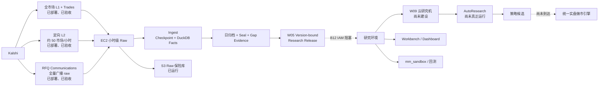

# 工程状态评审 2026-07-14(跨会话转达,VERBATIM ARCHIVE)

- received: 2026-07-14,操作员粘贴入 Cowork 会话(来源 = 有
  `HFT-BOT-pipeline-recovery` 克隆访问权的另一会话)
- 本会话对其中可核验项做了抽查(W06 探针 694.5 msg/s、B12、
  QUARANTINED_LEGACY、三分支分叉、W06 spec seq 机制均与仓库一致);
  未能独立核验项:EC2 机器升 64G、RFQ 4,400 行/分钟、L2 每小时约 50
  市场的当前选择器行为(EC2 侧事实,以生产侧档案为准)。
- 其"建立唯一 CURRENT_ENGINEERING_STATE.md"建议已执行:见
  `docs/CURRENT_ENGINEERING_STATE.md`(本次同一提交)。

---

## 转达原文(VERBATIM)

先给结论:我们已经造出了一座真实运行的数据采集厂,但还没有打通"封印数据 → 研究计算 → 策略候选 → 实盘执行"的完整流水线。 当前最接近完成的是 W05 研究数据桥;最不该做的是继续扩 L2、重做 Dashboard 或提前造完整实盘引擎。
以下状态基于截至 2026-07-14 的代码、收据和日志档案,不代表我刚刚重新 SSH 检查了 EC2 进程。
先统一四种状态

* 已构建:代码存在、测试过。
* 已部署:代码确实上了 EC2。
* 已验收:有真实生产数据和验收证据。
* 被阻塞:代码可能存在,但整条功能还不能用。
过去混乱的根源,就是很多 agent 把"已写代码"说成"已完成"。
整体架构



一、生产采集层
1. 全市场 L1 和成交
这是最成熟的生产主链:

* 全 Kalshi 市场 ticker/L1;
* 全市场 trades;
* WebSocket 实时接收;
* 小时轮转 `firehose_<HH>.ndjson*`;
* exchange timestamp、receive wall clock、receive monotonic 等 TL1 时间字段;
* 重连、seq/gap 和采集健康机制。
结论:全市场 L1 和成交数据确实在实时采集。
2. 定向 L2
W06 Stage 1 已部署。它使用第二条独立 WebSocket,记录 full-depth order book:

```
l2_<HH>.ndjson*
```

当前每小时大约选择 50 个市场:

* Tennis:约 12;
* Baseball/MLB:约 12;
* Soccer:约 8;
* Basketball/WNBA:约 8;
* Esports、Golf、BTC15m:少量对照。
优先选择临近开赛、open interest 较高的市场。
真实探针曾测到:

* 48 个市场;
* 728 秒;
* 505,879 条 book message;
* 694.5 msg/s;
* 0 parse error;
* 0 reconnect/drop;
* 每条约 530 bytes。
所以准确说法是:
我们有真实 L2,但不是所有体育、所有市场的全量 L2,而是每小时动态选择约 50 个市场。
尚未完成:

* 扩到约 200 市场的 Stage 2;
* 连续两个完整封印日的正式 L2 报告;
* B10 selector fail-closed 缺陷;
* L2 到回测器的正式 tape adapter。
相关代码:l2_targets.py、l2_gap_check.py(HFT-BOT-pipeline-recovery/tools/)。
3. RFQ
RFQ 也是真实上线,不是 synthetic:

* 独立 `kalshi-rfq-capture.service`;
* authenticated `communications` WebSocket;
* 收到真实 `rfq_created`、`rfq_deleted`;
* 专用 read-scope API key;
* 无下单、报价、接受 RFQ 能力;
* 独立于主 firehose 和 L2;
* 一键停用。
文件族:

```
rfq_<HH>.ndjson*
rfq_receipts_<HH>.ndjson*
```

初次验收约 4,400 行/分钟,观察到大量体育 MVE/combo RFQ。
但目前它只是 raw broadcast,尚未形成正式研究表。所以单靠现有数据不能完整推出:

* maker 报价价格;
* 哪个 quote 被接受;
* fill rate;
* RFQ maker PnL。
结论:
RFQ 实时采集已完成;RFQ 研究产品尚未完成。
代码:rfq_capture.py(HFT-BOT-pipeline-recovery/tools/)。
二、入库、封印和 S3
1. Ingest
`ingest.py` 负责:

* 扫描 raw;
* 生成 `orderbooks_l1`;
* 生成 `trades`;
* 生成 `orderbooks_full`;
* 保存逐文件 byte checkpoint;
* facts 与 checkpoint 同事务提交。
W03 已修复过一个真实严重问题:旧 ingest 遇到 DuckDB 锁后会启动即死,导致大量 raw 没入库但旧导出仍报绿。现在它会扫描:

* 今天;
* 昨天;
* 所有仍未封印的旧日期。
2. RFQ fast-path
RFQ 目前不生成 facts,因此主 ingest 不再逐行解析 RFQ JSON,而是:

* 只匹配 RFQ 两个文件族;
* 只推进到最后完整换行;
* 不修改 raw;
* 不写 facts;
* 原子提交 checkpoint。
这是正确的容量优化,已经进入生产谱系。
3. 日封印
正常链条是:

```
raw caught-up
→ archive export
→ manifest
→ seal
→ verify
→ capture_gaps
→ l2_gap_check
```

最新持久化生产报告显示,07-12 最终已完成:

* 2026-07-13 18:31Z 封印;
* verify PASS;
* 322 个 archive 文件;
* 109,146,215 行;
* `go_no_go=True`;
* seal hash 前缀 `bc37de4c…`;
* seal alarm 已清;
* 没有已证明的数据丢失。
这意味着之前"07-12 仍卡在 12 个 RFQ 文件"的报告已经过期。
但"为什么延迟一整天"尚未完全证明。BACKLOG 称是 ingest 与 export 的 DuckDB 锁竞争,但该解释和当前 supervisor 的 pause 代码并不完全吻合。可能涉及:

* 当时运行代码身份不同;
* 另一个启动器;
* recovery 脚本时序;
* 或根因报告不完整。
所以正确结论是:
07-12 已封印是事实;延迟根因仍需用 PID journal、部署 SHA 和锁日志复证。
4. S3 有两层
Raw 保险库
已经运行:

* closed-hour raw 同步;
* 活动小时排除,避免半截对象;
* daily facts/dim/catalog/seals/corrections 同步;
* 不使用 `--delete`。
所以 L1/L2/RFQ raw 可以已经存在于 S3。
W05 研究 Release
这是另一层:

```
research/releases/<release_id>/
```

它要把封印日发布成 agent 可安全读取的不可变数据集,包含:

* release ID;
* SHA-256;
* S3 VersionId;
* evidence tier;
* gap evidence;
* L2/RFQ 覆盖状态;
* write-once MANIFEST。
已有代码:

* 发布器:research_release.py
* Mac CLI:research_data.py
* post-seal hook:pipeline_supervisor.sh
真正 blocker 是 B12:

* Mac `researchReader` 已配置;
* EC2 `vaultWriter` 能向 `research/*` 写;
* 但缺 `s3:GetObject` 和 `s3:GetObjectVersion`;
* 发布器无法按上传后的精确 VersionId 回读验证;
* 因此 fail-closed,不生成最终 MANIFEST。
目前默认 confirmation-only view 仍为空。唯一可见的旧 release 是:

```
2026-07-11 / QUARANTINED_LEGACY
```

因此目前还不能说"agent 已经可以随时研究 07-12 的 L1/L2/RFQ"。数据在生产/S3 raw 层,但正式研究交付层还没验收。
三、研究工具
Research Workbench
已经有:

* hypothesis/experiment 浏览器;
* liquidity atlas;
* large-flow tape;
* event grouping;
* 本地 loopback API。
文件:sandbox/research/workbench/app.py
它目前主要读本地旧仓库,尚未接上最新 W05 release。
Event Intelligence Dashboard
已经有:

* Bookmap 风格热图;
* L1 liquidity;
* 有覆盖时的真实 L2;
* trades overlay;
* large-flow 标记;
* regime band;
* replay;
* gap 显示。
文件:sandbox/research/workbench/event_intel.py
但你之前说它"像死版展示面板",判断基本正确,因为正式版本仍主要使用:

* 07-06~08 数据;
* 21 个 episode;
* 很小的真实 L2 样本;
* RFQ 空;
* score/game-state 空;
* 分析指标薄,更多是 replay viewer。
W05-aware UI 已存在于 `pipe-w05-ui-data-root@34e3a38`,但没有合并。
mm_sandbox
已有可执行做市回放 MVP:

* submit/cancel latency;
* cancel-pending;
* partial fills;
* strict-through;
* queue;
* optimistic;
* 静态/动态 quote policy;
* fixed-point ledger;
* markout。
文件:sandbox/research/mm_sandbox.py
但目前只能称 `DIAGNOSTIC`:

* Gold 主要只有 07-06;
* queue 未用真实 L2 校准;
* tape 缺完整 recv-clock/source-seq 证明;
* 不能给经济 go/no-go verdict。
引擎性能组件
已有:

* simdjson 解码;
* fixed-point full-depth book;
* sid/seq invalidation;
* deterministic checksum;
* MPMC/SPSC queues;
* signed REST;
* token buckets/backoff;
* rule/risk/reconcile/panic 组件。
本地 kernel benchmark 证明速度远高于当前约 695 msg/s 的实测 L2 峰值。
但还缺完整证明:

* 真实最高 burst 小时 full-path replay;
* p99.9 端到端延迟;
* 完整封印日 checksum match;
* NIC/buffer/drop 证明;
* parse→book→strategy→risk→order 全路径。
engine_proof.cpp 目前仍是未跟踪文件。
四、AutoResearch 和 W09
AutoResearch
现在只有:

* mission prompt;
* 审计;
* 一次启动尝试。
启动在 `DATA_PLANE_GATE` 停止,零分析、零 W09 开销、零策略候选。
任务书还有四个小 P1:

* holdout reservation;
* log-odds;
* 多 session 与 exit ritual 冲突;
* 写路径未枚举。
这些应该一次文本修补完成,不应再开启大规模审计循环。
审计文件:docs/plan_audits/AUDIT_SPORTS_AUTORESEARCH_01_2026-07-13.md。
W09
目前只是注册了名字:

```
PIPE-W09 — REMOTE RESEARCH RUNNER
```

尚无:

* 实例;
* spend approval;
* IAM profile;
* job runner;
* cache;
* idle auto-shutdown。
目标架构是对的:生产机只采集,W09 从 S3 读封印数据做重计算,Mac 只做控制和可视化。
五、实盘执行栈
已有零件

* signed REST client;
* RequestExecutor;
* rate-limit/backoff;
* WebSocket/order-book engine;
* strategy plug-in;
* rule engine;
* risk ledger;
* reconcile;
* panic CLI;
* pricing/fair/quote;
* shadow/live 环境门。
尚未组装成安全的做市机器
关键缺口:

* 私有 order/fill WebSocket;
* resting-order registry;
* position/PnL 实时状态;
* QuoteManager;
* batch cancel/amend/decrease 的统一路径;
* post-only 全链路;
* WS book → strategy → risk → submit 单一路径;
* reserve-before-send;
* kill switch 全接线;
* position/notional/day-loss caps;
* ambiguous result 自动 reconcile;
* maker/taker fee 正式接线;
* shadow strategy roster 和连续 shadow evidence。
现在仍存在"两套世界":

* rich WS/full-depth engine 不发单;
* 可发单的 `tradingd` 仍偏 REST poll,部分路径还绕开统一 executor。
所以不是"实盘系统已建好,只差策略",而是:
数据引擎和很多执行零件已经有了,但统一实盘做市引擎尚未组装完成。
P00 已 PASS,但 P01 及以后仍未授权,见 docs/PLAN_SPORTS_TRADING_STATE.md。
六、为什么项目显得特别乱
1. 三条主要代码线分叉

* 生产管道:`codex/pipeline-recovery-hardening`
* 策略研究:`plan-sports-market-dynamics-v2`
* W05 UI:`pipe-w05-ui-data-root`
它们没有形成一个统一集成 tip。
2. 当前策略分支不能直接部署生产
当前 checkout 中的 supervisor 是旧版,缺少最新:

* HOTFIX-02;
* W05;
* W06 L2;
* W07 RFQ;
* 新 seal 行为。
从当前策略分支直接部署,有回滚生产能力的风险。
因此下一次生产部署必须从 pipeline-recovery 生产谱系出发。
3. 文档漂移
例如:

* RFQ 文档还写未部署;
* 旧 gate 报告写 07-12 未封;
* README 仍写 16G 机器,实际已升 64G;
* reader key 的旧记录没有同步更新;
* W05 spec 被很多 addendum 淹没。
4. 大量未跟踪产物和嵌套仓库
当前存在未跟踪的:

* reports;
* outputs;
* `engine_proof.cpp`;
* recovery clone;
* handoff patches;
* `.claude` worktrees。
嵌套 Git clone 还会污染全仓搜索结果。
5. 没有持续 CI
当前 gate 主要靠手动测试。每个分支都曾经绿过,但还没有一个统一集成 tip 同时跑过:

* 最新 pipeline;
* W05;
* W05 UI;
* research/sandbox;
* registry;
* adversarial tests。
七、最简单的"有和没有"
已经有

* 全市场 L1;
* 全市场 trades;
* 定向约 50 市场 L2;
* 全交易所 RFQ broadcast;
* TL1 receive timestamps;
* DuckDB facts/checkpoints;
* daily seal;
* S3 raw vault;
* Workbench;
* Dashboard;
* 做市回放 MVP;
* 高性能 order-book/decoder;
* 大量安全与执行组件。
还没有

* 最新确认级 S3 research release;
* `DATA_PLANE_ACCEPTED`;
* W09;
* 整理后的 RFQ research tables;
* 最新 L2/RFQ 驱动的 Dashboard;
* score/game-state;
* AutoResearch 结果;
* 可信经济 verdict 回测器;
* 统一安全的 live maker engine;
* 任何通过 shadow/micro-live 的策略。
八、我建议的下一步
第一优先:完成 W05
只做这条:

1. 给 EC2 `vaultWriter` 的 `research/*` 增加最小权限:
   * `s3:GetObject`
   * `s3:GetObjectVersion`
2. 重发 07-12 version-bound release;
3. Mac 无 SSH 执行 inventory/fetch/verify;
4. 确认 L1/trades/L2/RFQ 覆盖;
5. 落下 `DATA_PLANE_ACCEPTED`。
这一步完成,研究 agent 才真正拥有最新数据。
第二优先:建设 W09

* 按需启动;
* 只读 S3;
* 报告每次成本;
* idle 自动关机;
* 生产机不跑研究。
第三优先:第一轮真实研究
先研究:

* cross-sport atlas;
* 3-way overround;
* large-flow continuation/reversal;
* L2 depletion/refill/jump;
* RFQ create/delete duration、size、combo/leg、repeat requester;
* calm/toxic regime maker simulation。
先 exploratory 找规律,再冻结假设。
第四优先:只为通过的策略补执行能力
等出现 2–4 个候选后,再围绕它们补:

* QuoteManager;
* private fills;
* positions;
* batch cancel/amend;
* post-only;
* risk/kill/reconcile;
* shadow → micro-live。
现在不要扩 L2 到 200,不要继续重做 Dashboard,不要启动生产 AutoResearch,也不要先造完整实盘系统。
另外需要一个很小的工程收口动作:建立唯一的 `CURRENT_ENGINEERING_STATE.md`,明确每项 `BUILT / DEPLOYED / ACCEPTED / BLOCKED`,并指定唯一生产分支。这样以后不再从几十份旧收据里猜当前状态。
